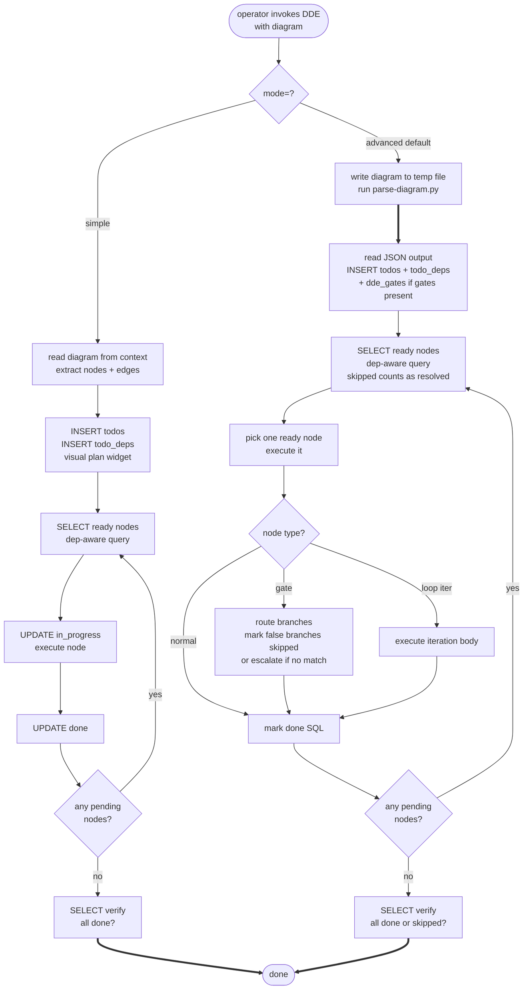

# diagram-driven-execution

- [Driver persona](agents/diagram-driver.agent.md)
- [Grammar rule](references/diagram-grammar.md)
- [Advanced mode protocol](references/transition-protocol.md)
- [Simple mode protocol](references/plan-store-protocol.md)

This skill turns a mermaid diagram into a **tracked execution plan**.
The diagram is the process contract. Two execution modes are supported,
both using the session SQL `todos` table (both produce the Copilot visual
plan widget):

- **`mode="advanced"` (default):** uses `todos` + `todo_deps`. A
  deterministic script (`parse-diagram.py`) extracts nodes and edges;
  the agent loads them into SQL and drives execution by querying for ready
  nodes via dependency-aware query. Supports DAGs, parallel branches,
  conditional gates with multi-way routing and escalation, and bounded
  loops via pre-expansion.
- **`mode="simple"` (lightweight):** uses `todos` + `todo_deps`. The
  agent reads the diagram from context, INSERTs todos and deps, and
  drives execution via the ready-node query. No parse script. No gates
  or loops. For flows ≤ 15 nodes that do not require gate/loop logic.

Deprecated aliases: `store="plan"` routes to simple; `store="sql"` routes
to advanced. Accept them silently and apply the correct mode discipline.

## Embedding DDE in a skill (AML block)

Declare DDE as a dependency in your skill's invocation block to enforce
diagram-driven tracking on a specific workflow:

```xml
<!-- Simple mode: small DAGs or linear flows, ≤15 nodes, no gates/loops -->
<skill ref="dde" role="enforcement" mode="simple">

<!-- Advanced mode: gates, loops, parallel branches, deterministic parse -->
<skill ref="dde" role="enforcement" mode="advanced">
```

The `mode=` attribute is the B2 CONDITIONAL DISPATCH selector that the
driver persona reads at the start of each run. If omitted, advanced mode
is the default.

## When to activate

- The operator hands you a flowchart or state diagram and expects the
  steps to be executed in order.
- The operator says any of: "follow this diagram", "drive this workflow",
  "enforce these steps", "step me through", "track this state machine".
- You are about to execute a multi-step process and want dependency-aware
  transition tracking instead of free-form narration.

Do NOT activate for: drawing diagrams, explaining diagrams, rendering or
pretty-printing mermaid, checking diagram syntax in isolation.

## What this skill does NOT do

- It does not implement node bodies. Each node's work is delegated to a
  subagent, a tool, or this thread's own prompt — chosen via the node's
  `type=` annotation (see grammar rule).
- It does not invent diagrams. If you have a process described in prose,
  ask the operator for the diagram first.
- It does not interpret intent. If a node label is ambiguous, the driver
  persona halts to a human checkpoint.

## Execution modes

| | `mode="simple"` | `mode="advanced"` (default) |
|---|---|---|
| **Visual plan widget** | yes | yes |
| **State store** | `todos` + `todo_deps` | `todos` + `todo_deps` |
| **Parser** | agent reads from context | `parse-diagram.py` subprocess |
| **Graph type** | linear or small DAG (≤15 nodes) | any DAG |
| **Gates** | no (B10 if detected) | yes — multi-way + escalation |
| **Loops** | no (B10 if detected) | yes — bounded pre-expansion |
| **Multi-agent** | single agent | yes |
| **Token cost** | lower | higher |

Read `references/plan-store-protocol.md` for simple mode.
Read `references/transition-protocol.md` for advanced mode.

## Applicability (when dde is worth its overhead)

dde adds value by replacing free-form todo mutation with a
diagram-grounded, queryable execution record. That ceremony is
load-bearing for some workloads and pure overhead for others.
Reach for dde when AT LEAST ONE holds:

- The plan has more than ~3 nodes.
- Any fan-out, parallelism, or multiple writers touch the same plan.
- Topological ordering matters (drafting in the wrong order costs rework).
- The work spans sessions or threads and must re-ground itself on resume
  (B4 PLAN MEMENTO / B8 ATTENTION ANCHOR).
- "Done" must be a deterministic gate (SQL completion query), not an
  LLM assertion.
- The workflow contains conditional branches (use advanced) or known
  repeated steps (use advanced with `type=loop|max_iter=N`).

Do NOT reach for dde when ANY of the following describes the work:

- Single-node task ("fix this typo", "bump this version"). No DAG;
  authoring a diagram is pure ceremony.
- Strictly linear, short (≤3 steps), throwaway work. A plain todo list
  does the same job with less ceremony.
- Exploratory or discovery work where steps are not known in advance.
  dde requires the diagram up front.
- Advisory or conversational turns with no execution to gate.
- REPL-style iteration where the plan churns every turn.

Rule of thumb: if a plain `todos` list covers the job, skip dde.
If you need a dependency-ordered, resumable, deterministically completable
plan — with or without gates and loops — use dde.

### Decision matrix: which mode to pick

```
Does the workflow have gates (type=gate) or loops (type=loop)?
├── YES → mode="advanced"
└── NO  → Is the node count ≤15 and mermaid syntax standard?
           ├── NO  → mode="advanced" (parse script handles complex syntax)
           └── YES → mode="simple"  ← lighter, no parse script
```

Both modes produce the Copilot visual plan widget with dependency tree
nesting. Use `mode="advanced"` when you need gate routing, loop
pre-expansion, or a parse script for complex mermaid syntax.

## Process



`==>` edges carry deterministic tool output back into the LLM step
(S7 DETERMINISTIC TOOL BRIDGE). `-->` edges are LLM-internal flow.

### mode="simple" — step-by-step

Read `references/plan-store-protocol.md` when `mode="simple"` is declared.

**Summary:** read diagram from context, extract nodes and edges → INSERT
todos + todo_deps in one call → loop: SELECT ready (dep-aware) + UPDATE
in_progress + execute + UPDATE done → SELECT verify.

### mode="advanced" — step-by-step

Read `references/transition-protocol.md` when `mode="advanced"` is
declared (or by default).

#### Step 1 — parse the diagram

Save the operator's mermaid to a file. Invoke:

```
python3 scripts/parse-diagram.py --input <file> [--design-id <id>]
```

Exit code 2 means the diagram falls outside the v1 grammar (see
`references/diagram-grammar.md`); return the diagnostic to the operator
and stop — do not patch.

`design_id` must match `[A-Za-z0-9][A-Za-z0-9_-]{0,63}`.

#### Step 2 — load the plan (SQL)

Check for collisions:
```sql
SELECT id FROM todos WHERE id LIKE '<design_id>::%' LIMIT 1;
```
If rows exist, halt — the `design_id` is already in use.

Insert one `todos` row per node and one `todo_deps` row per edge.
If gate nodes are present, also create `dde_gates` and insert routing
rows (see `references/transition-protocol.md`).

If `type=loop|max_iter=N` nodes are present, pre-expand them into N
iteration todos at this step — before execution begins.

The `description` field MUST contain a JSON object with node metadata:
```json
{"dde": true, "design_id": "x", "node_id": "A", "label": "Backend",
 "type": "subagent", "model": "opus", "max_iter": 1, "shape": "rect"}
```

#### Steps 3-6 — query ready nodes, execute, mark done

EVERY TURN, before deciding anything:
```sql
SELECT t.id, t.title FROM todos t
WHERE t.id LIKE '<design_id>::%'
  AND t.status = 'pending'
  AND NOT EXISTS (
    SELECT 1 FROM todo_deps td
    JOIN todos dep ON td.depends_on = dep.id
    WHERE td.todo_id = t.id
      AND dep.status NOT IN ('done', 'skipped')
  );
```

Pick one ready node, mark `in_progress`, execute (dispatch by `type`),
mark `done` (or `blocked`). Gate nodes also update false-branch nodes
to `skipped`. Loop iteration nodes execute the body with `{"iter": K}`
in context.

#### Step 7 — verify completion

```sql
SELECT status, COUNT(*) as cnt FROM todos
WHERE id LIKE '<design_id>::%' GROUP BY status;
```

All nodes should show `done` or `skipped`. Anything else → B10.

## Platform and runtime

This skill targets `common-only`. Advanced mode requires Python 3 on
PATH, used once at the start to parse the diagram. Simple mode requires
no external tools. The parser uses only the Python standard library.

## Bundled assets

- `scripts/parse-diagram.py` — deterministic mermaid parser (bounded
  grammar; rejects unsupported syntax loudly). Stdlib-only.
- `agents/diagram-driver.agent.md` — the process-execution lens.
- `references/diagram-grammar.md` — the supported grammar subset.
- `references/transition-protocol.md` — advanced mode agent contract.
- `references/plan-store-protocol.md` — simple mode agent contract.

## Composition

This skill composes with **example 06** (TIERED SUPERVISED EXECUTION).
Node `model=` annotations cross-reference into the per-spawn model-tier
discipline: a "diagram with model weights" is both process-deterministic
AND cost-aware.

## Limitations (declared)

- DISCIPLINE-BASED ENFORCEMENT. No script-level gate prevents illegal
  transitions. The persona and this skill's discipline are the only
  enforcement.
- Simple mode (`mode="simple"`) does NOT support gate or loop nodes.
  Detection triggers B10 before any todos are inserted.
- v1 grammar excludes subgraphs, composite states, classDefs, styling,
  click handlers (see `references/diagram-grammar.md`).
- Diagram cycles are rejected in all diagram types. Loop repetition is
  expressed via `type=loop|max_iter=N` annotation (pre-expansion).
- Re-planning is a B10 event by design. Mid-run diagram edits are
  refused; the operator must start a new design with a new `design_id`.
- Condition-based loops (iterate until condition met) are not supported
  in v0.5. Use bounded loops (`max_iter=N`) or model iterations as
  sequential nodes.
