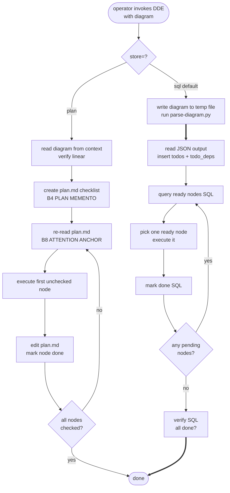

# diagram-driven-execution

- [Driver persona](agents/diagram-driver.agent.md)
- [Grammar rule](references/diagram-grammar.md)
- [Transition protocol — SQL mode](references/transition-protocol.md)
- [Plan-store protocol — plan.md mode](references/plan-store-protocol.md)

This skill turns a mermaid diagram into a **tracked execution plan**.
The diagram is the process contract. Two tracking stores are supported,
declared with `store=` in the skill invocation block:

- **`store="sql"` (default):** uses the session's `todos` and
  `todo_deps` tables. A deterministic script (`parse-diagram.py`)
  extracts nodes and edges; the agent loads them into SQL and drives
  execution by querying for ready nodes one at a time.
- **`store="plan"`:** uses the session's `plan.md` slot. The agent
  reads the diagram from context, writes a checklist to plan.md, and
  updates it per node. No subprocess, no SQL. For linear flows only.

## Embedding DDE in a skill (AML block)

Declare DDE as a dependency in your skill's invocation block to
enforce diagram-driven tracking on a specific workflow:

```xml
<!-- SQL mode: DAGs, parallel branches, strict completion gates -->
<skill ref="dde" role="enforcement" store="sql">

<!-- plan.md mode: linear workflows, ≤10 nodes, single agent -->
<skill ref="dde" role="enforcement" store="plan">
```

The `store=` attribute is the B2 CONDITIONAL DISPATCH selector that
the driver persona reads at the start of each run.

## When to activate

- The operator hands you a flowchart or state diagram and expects
  the steps to be executed in order.
- The operator says any of: "follow this diagram", "drive this
  workflow", "enforce these steps", "step me through", "track
  this state machine".
- You are about to execute a multi-step process and want
  dependency-aware transition tracking instead of free-form
  narration.

Do NOT activate for: drawing diagrams, explaining diagrams,
rendering or pretty-printing mermaid, checking diagram syntax in
isolation. Those are not execution tasks.

## What this skill does NOT do

- It does not implement node bodies. Each node's work is delegated
  to a subagent, a tool, or this thread's own prompt — chosen via
  the node's `type=` annotation (see grammar rule).
- It does not invent diagrams. If you have a process described in
  prose, ask the operator for the diagram first.
- It does not interpret intent. If a node label is ambiguous, the
  driver persona halts to a human checkpoint.

## Store modes

| | `store="sql"` (default) | `store="plan"` |
|---|---|---|
| **State store** | `todos` + `todo_deps` SQL tables | session `plan.md` slot |
| **Parser** | `parse-diagram.py` subprocess | in-context diagram read |
| **Graph type** | DAGs + linear | linear only (≤10 nodes) |
| **Parallelism** | yes (ready-set query) | no (first-unchecked) |
| **Multi-agent** | yes | no (single agent) |
| **Completion gate** | deterministic SQL query | human-readable checklist |
| **Enforcement** | query-grounded | discipline-based only |
| **Tracking calls** | ~20 for 7-node flow | ~8 for 7-node flow |

Read `references/transition-protocol.md` for SQL mode.
Read `references/plan-store-protocol.md` for plan.md mode.

## Applicability (when dde is worth its overhead)

dde adds value by replacing free-form todo mutation with a
diagram-grounded, queryable execution record. That ceremony is
load-bearing for some workloads and pure overhead for others.
Reach for dde when AT LEAST ONE holds:

- The plan has more than ~3 nodes.
- Any fan-out, parallelism, or multiple writers touch the same
  plan.
- Topological ordering matters (drafting in the wrong order
  costs rework).
- The work spans sessions or threads and must re-ground itself
  on resume (B4 PLAN MEMENTO / B8 ATTENTION ANCHOR).
- "Done" must be a deterministic gate (SQL completion query),
  not an LLM assertion.

Do NOT reach for dde when ANY of the following describes the
work:

- Single-node task ("fix this typo", "bump this version"). No
  DAG; authoring a diagram is pure ceremony.
- Strictly linear, short (<=3 steps), throwaway work. A plain
  todo list does the same job with less ceremony.
- Exploratory or discovery work where the steps are not known
  in advance. dde requires the diagram up front; authoring it
  during exploration creates a chicken-and-egg.
- Advisory or conversational turns with no execution to gate
  (Q&A, critique, code review).
- REPL-style iteration where the plan churns every turn.

Rule of thumb: if a plain `todos` list covers the job, skip dde.
If you need a dependency-ordered, resumable, deterministically
completable plan, use dde.

### Decision matrix: which mode to pick

```
Is the workflow strictly linear (no branches)?
├── NO  → store="sql"  (DAG topology requires SQL dependency tracking)
└── YES → Does it have ≤10 nodes AND run in a single agent?
           ├── NO  → store="sql"
           └── YES → Do you need a programmatic all-done gate?
                      ├── YES → store="sql"
                      └── NO  → store="plan"  ← lightweight path
```

The mandate genesis applies to its step 7b is correctly scoped
because genesis output is always a multi-module DAG with
ordering constraints, ~5-20 nodes, and a "every module drafted
and validated" completion gate — it meets every `store="sql"`
criterion. Other skills considering dde should make the call
case by case against this section, not by analogy to genesis.

## Process



`==>` edges carry deterministic tool output back into the LLM step
(S7 DETERMINISTIC TOOL BRIDGE). `-->` edges are LLM-internal flow.

### store="sql" — step-by-step

Read `references/transition-protocol.md` for the full SQL protocol.

#### Step 1 — parse the diagram

Save the operator's mermaid to a file (if inline, write to a
temp). Invoke:

```
python3 scripts/parse-diagram.py --input <file> [--design-id <id>]
```

Captures the parsed JSON. Exit code 2 means the diagram falls
outside the v1 grammar (see `references/diagram-grammar.md`);
return the diagnostic to the operator and stop -- do not patch.

Note: `design_id` must match `[A-Za-z0-9][A-Za-z0-9_-]{0,63}`.

#### Step 2 — load the plan (SQL)

The agent reads the parsed JSON and inserts rows into the session
SQL store. Before loading, check for collisions:

```sql
SELECT id FROM todos WHERE id LIKE '<design_id>::%' LIMIT 1;
```

If rows exist, halt — the `design_id` is already in use.

Insert one `todos` row per node:

```sql
INSERT INTO todos (id, title, description, status)
VALUES ('<design_id>::<node_id>', '[<design_id>] <label>', '<json_metadata>', 'pending');
```

The `description` field MUST contain a JSON object with node
metadata so dispatch information survives across turns:

```json
{"dde": true, "design_id": "x", "node_id": "A", "label": "Backend", "type": "subagent", "model": "opus", "max_iter": 1, "shape": "rect", "terminal": false}
```

Insert one `todo_deps` row per edge (skip `[*]` pseudostates):

```sql
INSERT INTO todo_deps (todo_id, depends_on)
VALUES ('<design_id>::<child>', '<design_id>::<parent>');
```

#### Step 3 — query ready nodes

EVERY TURN, before deciding anything:

```sql
SELECT t.id, t.title FROM todos t
WHERE t.id LIKE '<design_id>::%'
  AND t.status = 'pending'
  AND NOT EXISTS (
    SELECT 1 FROM todo_deps td
    JOIN todos dep ON td.depends_on = dep.id
    WHERE td.todo_id = t.id AND dep.status != 'done'
  );
```

This returns nodes that are `pending` and have no unfinished
dependencies — the "ready set". Three outcomes:

- **Rows returned**: at least one node is ready. Pick one.
- **No rows, but non-done nodes exist**: stuck. Emit B10 HUMAN
  CHECKPOINT.
- **No non-done nodes remain**: all done. Go to step 7.

#### Steps 4-6 — pick, execute, mark done

1. PICK one node from the ready set. Read its `description` JSON
   for dispatch metadata (`type`, `model`).
2. Mark it in progress:
   ```sql
   UPDATE todos SET status = 'in_progress', updated_at = datetime('now')
   WHERE id = '<design_id>::<node_id>';
   ```
3. EXECUTE the node body. Dispatch by `type`:
   - `manual`: the operator does this step out-of-band; wait.
   - `subagent`: spawn a child thread. Compose with example 06
     (TIERED SUPERVISED EXECUTION) for cost-aware spawning.
   - `tool`: invoke a deterministic tool.
   - `prompt` (default): you do it in this thread.
4. Mark it done:
   ```sql
   UPDATE todos SET status = 'done', updated_at = datetime('now')
   WHERE id = '<design_id>::<node_id>';
   ```
   Or mark it blocked if the node failed:
   ```sql
   UPDATE todos SET status = 'blocked', description = '<original_json with failure note>', updated_at = datetime('now')
   WHERE id = '<design_id>::<node_id>';
   ```

#### Step 7 — verify completion

```sql
SELECT status, COUNT(*) as cnt FROM todos
WHERE id LIKE '<design_id>::%' GROUP BY status;
```

All nodes should show status `done`. If any show `blocked` or
`pending`, the design is incomplete — emit B10.

### store="plan" — step-by-step

Read `references/plan-store-protocol.md` when `store="plan"` is
declared in the skill invocation block.

## Platform and runtime

This skill targets `common-only`. For SQL mode, the only external
dependency is Python 3 on PATH, used ONCE at the start to parse
the diagram. All subsequent SQL state tracking uses the session's
native store — no Python in the execution loop. For plan.md mode,
no external tools are required; the agent uses the session's
built-in create/edit file operations.

The parser uses only the Python standard library; no pip install,
no external sqlite3 binary.

## Bundled assets

- `scripts/parse-diagram.py` — deterministic mermaid parser
  (bounded grammar; rejects unsupported syntax loudly).
  Self-contained, stdlib-only.
- `agents/diagram-driver.agent.md` — the process-execution lens.
- `references/diagram-grammar.md` — the supported grammar subset.
- `references/transition-protocol.md` — SQL mode agent contract.
- `references/plan-store-protocol.md` — plan.md mode agent contract.

## Composition

This skill composes with **example 06** (TIERED SUPERVISED
EXECUTION). Node `model=` annotations cross-reference into the
per-spawn model-tier discipline: a "diagram with model weights" is
both process-deterministic AND cost-aware.

See `skills/genesis/examples/06-tiered-supervised-execution.md`
for the peer recipe.

## Limitations (declared)

- DISCIPLINE-BASED ENFORCEMENT. The agent retains the capability
  to bypass the transition protocol. The persona + this skill's
  discipline are the only enforcement. There is no script-level
  gate preventing illegal transitions in either store mode.
- plan.md mode does NOT support DAGs. Branches trigger B10.
- v1 grammar excludes subgraphs, composite states, classDefs,
  styling, click handlers (see `references/diagram-grammar.md`).
- Cycles are rejected in all diagram types (flowchart and
  stateDiagram-v2). The dependency model requires acyclic graphs.
- Re-planning is a B10 event by design. Mid-run diagram edits are
  refused; the operator must explicitly start a new design with a
  new `design_id`.
