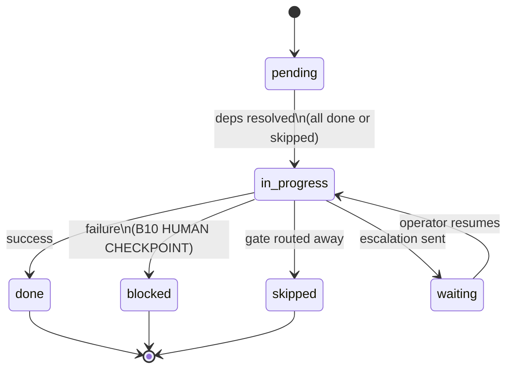

# transition-protocol (rule)

Auto-attach: any thread that holds the `diagram-driver` persona AND
whose skill invocation block declares `mode="advanced"`, OR when the
driver detects loop/gate node types in any diagram.

This rule defines the agent contract for the **advanced execution path**:
deterministic parse via `parse-diagram.py`, full dependency graph via
`todo_deps`, and extended execution model supporting bounded loops,
multi-way conditional gates, and escalation.

## Extended status model

| Status | Meaning | Dep resolution |
|--------|---------|----------------|
| `pending` | awaiting deps | — |
| `in_progress` | executing | — |
| `done` | terminal success | resolves deps |
| `blocked` | terminal failure | does not resolve |
| `skipped` | gate routed away | resolves deps (same as done) |
| `waiting` | escalation checkpoint | does not resolve until resumed |

## Permitted SQL operations

### Read operations (any time)

Query ready nodes (skipped counts as resolved):
```sql
SELECT t.id, t.title FROM todos t
WHERE t.id LIKE '<design_id>::%'
  AND t.status = 'pending'
  AND NOT EXISTS (
    SELECT 1 FROM todo_deps td
    JOIN todos dep ON td.depends_on = dep.id
    WHERE td.todo_id = t.id
      AND dep.status NOT IN ('done', 'skipped')
  );
```

Query completion status:
```sql
SELECT status, COUNT(*) as cnt FROM todos
WHERE id LIKE '<design_id>::%' GROUP BY status;
```

Detect stuck state (no ready nodes but non-terminal nodes remain):
```sql
SELECT COUNT(*) FROM todos t
WHERE t.id LIKE '<design_id>::%'
  AND t.status = 'pending'
  AND NOT EXISTS (
    SELECT 1 FROM todo_deps td
    JOIN todos dep ON td.depends_on = dep.id
    WHERE td.todo_id = t.id
      AND dep.status NOT IN ('done', 'skipped')
  );
-- Returns 0 while non-done/non-skipped/non-blocked nodes exist → stuck
```

Read node metadata:
```sql
SELECT id, title, description FROM todos
WHERE id = '<design_id>::<node_id>';
```

### Write operations

Mark a node in progress:
```sql
UPDATE todos SET status = 'in_progress', updated_at = datetime('now')
WHERE id = '<design_id>::<node_id>';
```

Mark a node done / blocked / skipped / waiting:
```sql
UPDATE todos SET status = '<status>', updated_at = datetime('now')
WHERE id = '<design_id>::<node_id>';
```

## Forbidden operations

- Any `INSERT` against `todos` rows with `<design_id>::` prefix after
  initial load — **except** loop child injection (see Bounded loops).
- Any `INSERT`, `UPDATE`, or `DELETE` against `todo_deps` rows after
  initial load.
- Updating `status` to any value other than `in_progress`, `done`,
  `blocked`, `skipped`, or `waiting`.
- Marking a node `in_progress` without first confirming it appears in
  the ready-nodes query result.
- Marking a `waiting` node back to `in_progress` without explicit
  operator or parent-session authorisation.

## Per-node lifecycle



- `pending`: ready when all deps are `done` or `skipped`.
- `in_progress`: agent is executing this node.
- `done`: terminal success. Re-query to discover newly-ready nodes.
- `blocked`: terminal failure. Requires B10 HUMAN CHECKPOINT.
- `skipped`: gate routed execution away from this branch. Resolves deps.
- `waiting`: escalation sent to parent session or human. Node resumes
  when the operator or parent session responds with a decision.

Illegal transitions: `pending → done`, `done → pending`,
`blocked → in_progress` (without operator direction),
`skipped → anything`.

## Gate nodes (type=gate)

A gate node evaluates a condition and routes execution to one of
multiple branches via edge labels.

### Gate init (at plan-load time)

When `parse-diagram.py` detects a `type=gate` node, it outputs the
gate's outgoing edge labels in the JSON manifest. At plan-init, create
the `dde_gates` table (if not yet created) and INSERT gate routing rows:

```sql
CREATE TABLE IF NOT EXISTS dde_gates (
  gate_id   TEXT,  -- gate todo id
  label     TEXT,  -- edge label from diagram (e.g. "pass", "fail", "default")
  target_id TEXT,  -- first node id in that branch
  PRIMARY KEY (gate_id, label)
);

INSERT INTO dde_gates (gate_id, label, target_id) VALUES
  ('<design_id>::<gate_node>', 'pass',    '<design_id>::<branch_pass_root>'),
  ('<design_id>::<gate_node>', 'fail',    '<design_id>::<branch_fail_root>'),
  ('<design_id>::<gate_node>', 'default', '<design_id>::<branch_default_root>');
```

### Gate execution discipline

1. Mark gate `in_progress`.
2. Execute the gate body — evaluate the condition.
3. Store the result in the gate's `description` JSON:
   ```sql
   UPDATE todos SET description = '{"result":"<matched_label>"}',
     status = 'in_progress'
   WHERE id = '<gate_todo_id>';
   ```
4. Look up `dde_gates` to find the matching branch:
   ```sql
   SELECT label, target_id FROM dde_gates
   WHERE gate_id = '<gate_todo_id>';
   ```
5. For each branch label:
   - If label matches the result: leave the branch root as `pending`
     (it will become ready when the gate resolves).
   - If label does NOT match: mark the branch root `skipped`.
     Recursively mark the entire sub-branch `skipped`:
     ```sql
     -- Mark direct non-matching branch root
     UPDATE todos SET status = 'skipped' WHERE id = '<branch_root>';
     -- Repeat for each downstream node in that branch
     -- (walk todo_deps to find all descendants)
     ```
6. Mark gate `done`.
7. Re-query ready nodes — the active branch root is now ready.

### Escalation (no matching branch)

If none of the gate's labels match the result:
- If a parent session is available (`from_project_session_id` in context):
  1. Mark gate `waiting`.
  2. Send a cross-session message via `send_session_message`:
     `"Gate <gate_id> has no matching branch for result '<result>'. Labels available: <labels>. Awaiting routing decision."`
  3. Stop execution. Resume when the parent session responds.
- If no parent session:
  1. Emit B10 HUMAN CHECKPOINT with the unmatched result and available labels.
  2. Mark gate `waiting`.
  3. Stop execution.

## Bounded loops (type=loop)

A `type=loop` node with `max_iter=N` annotation defines a bounded loop.
The loop body is pre-expanded at plan-init time into N sequential iteration
todos — no runtime plan mutation.

### Loop pre-expansion (at plan-load time)

When `parse-diagram.py` detects a `type=loop` node with `max_iter=N`,
it emits expansion metadata. At plan-init, the agent replaces the single
loop todo with N iteration todos:

```sql
-- Instead of one loop_body todo, insert N iteration todos:
INSERT INTO todos (id, title, description) VALUES
  ('<design_id>::<loop_id>::iter_1', '<loop_label> (1/<N>)', '{"design_id":"<design_id>","node":"<loop_id>","iter":1}'),
  ('<design_id>::<loop_id>::iter_2', '<loop_label> (2/<N>)', '{"design_id":"<design_id>","node":"<loop_id>","iter":2}'),
  ...
  ('<design_id>::<loop_id>::iter_N', '<loop_label> (<N>/<N>)', '{"design_id":"<design_id>","node":"<loop_id>","iter":<N>}');

-- Chain the iterations:
INSERT INTO todo_deps (todo_id, depends_on) VALUES
  ('<design_id>::<loop_id>::iter_2', '<design_id>::<loop_id>::iter_1'),
  ('<design_id>::<loop_id>::iter_3', '<design_id>::<loop_id>::iter_2'),
  ...
  ('<design_id>::<loop_id>::iter_N', '<design_id>::<loop_id>::iter_{N-1}');

-- Wire loop to the predecessor and successor of the original loop node:
-- predecessor → iter_1 (instead of predecessor → loop)
-- iter_N → successor (instead of loop → successor)
INSERT INTO todo_deps (todo_id, depends_on) VALUES
  ('<design_id>::<loop_id>::iter_1', '<design_id>::<predecessor>'),
  ('<design_id>::<successor>', '<design_id>::<loop_id>::iter_N');
```

Each iteration executes the same node body with `{"iter": K}` in context.
The visual plan shows all N iterations as a chained sequence.

### Loop discipline

- Each iteration is an independent node: `pending → in_progress → done`.
- The loop body description context carries `"iter": K` — the agent uses
  this to parameterise the iteration (e.g., process item K of N).
- Iterations execute sequentially (by deps). Parallel iterations require
  removing the inter-iteration deps (declare in diagram as parallel nodes).
- `max_iter` is the upper bound. The agent may mark remaining iterations
  `skipped` early if the loop condition is satisfied before all N complete.

## Design ID convention

Todo IDs use the composite pattern `<design_id>::<node_id>`.
Design IDs must match `[A-Za-z0-9][A-Za-z0-9_-]{0,63}` to be
SQL-literal-safe and prefix-safe for LIKE queries.
